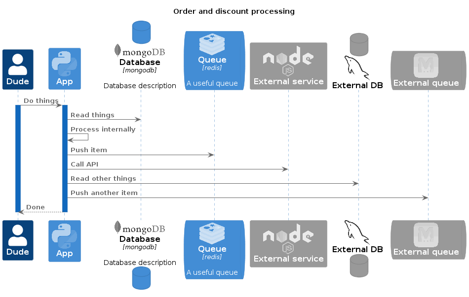

# C4Seq-Plantuml
C4Seq allows you to create sequence diagrams with the same appearance and syntax as
the [C4-PlantUML](https://github.com/plantuml-stdlib/C4-PlantUML) library to have a uniform
style for all the diagrams in your project.

See [example.puml](./example.puml) for the code.

## Why C4Seq

The [C4 model](https://c4model.com/) is an amazing solution to visualizing software architecture.
These diagrams can be created using plantuml and its standard library
from the UML specification when it comes to representing the sequence of interactions between
the elements of an architecture.

C4-PlantUML has implemented only the C4 diagrams therefore sequence diagrams would look
very different and disconnected from the C4 diagrams in the documentation of a software
architecture.
